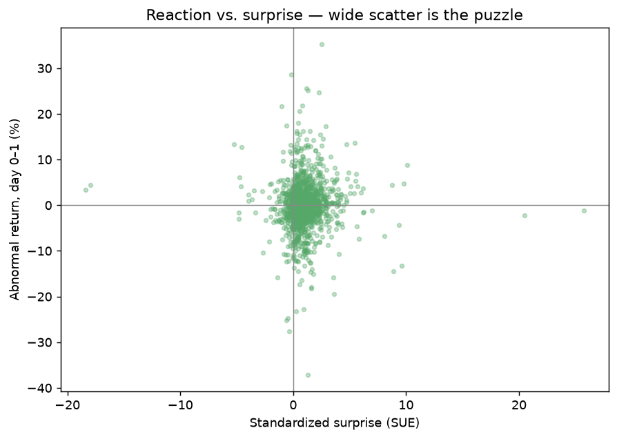
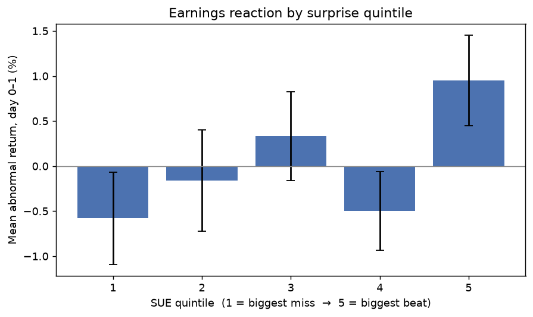
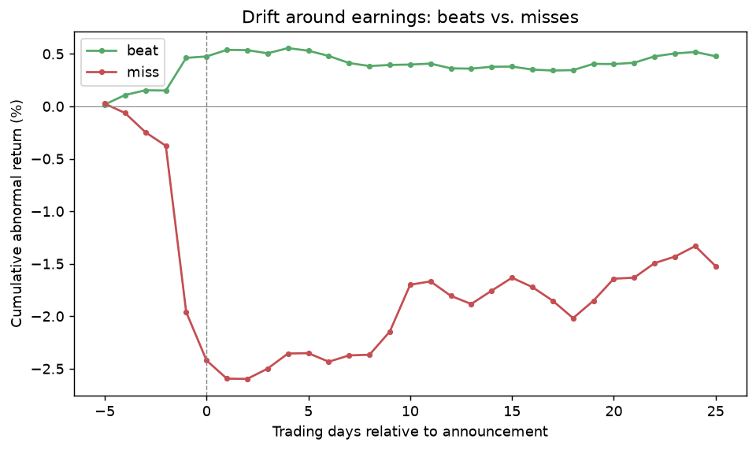
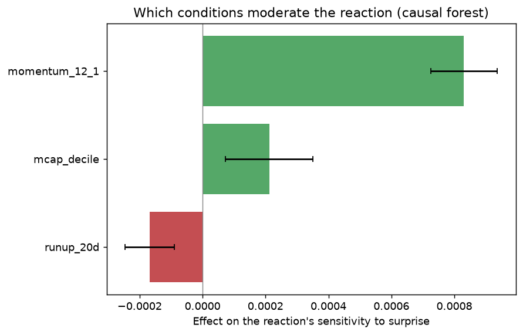
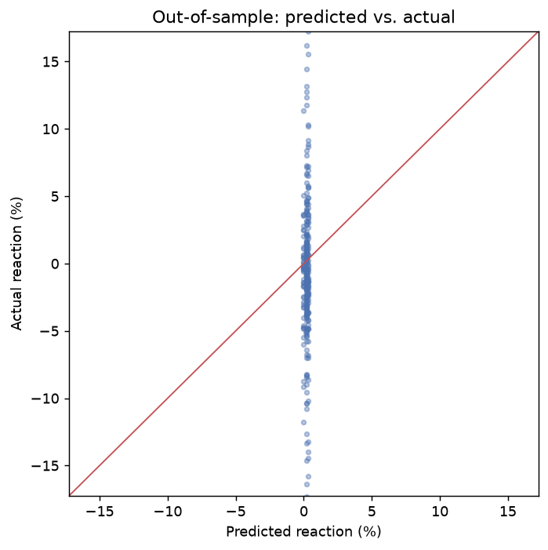
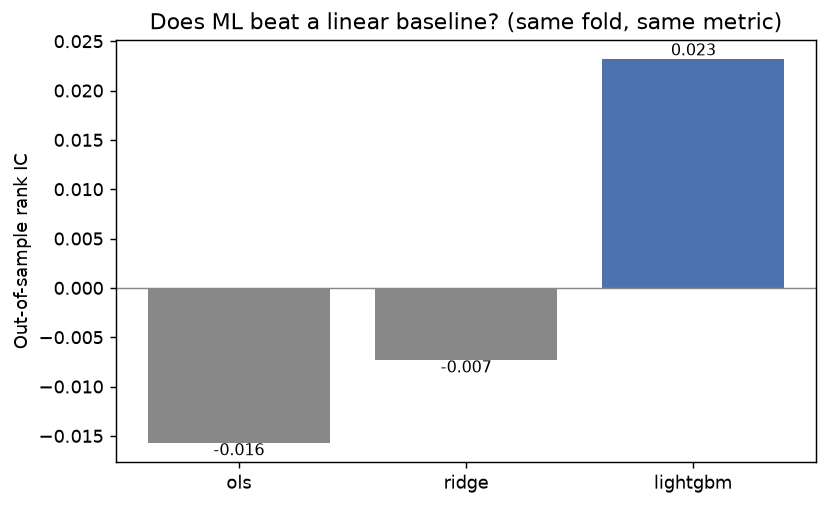

# Earnings Reaction Lab

**Why do identical earnings beats produce opposite price reactions?** When Meta beats EPS
estimates by ~5% the stock can fall 7%, while Shopify beats by a similar margin the same
season and rises 5%. The size of the surprise clearly is not the whole story. This project
measures *which conditions* change how the market reacts to an earnings surprise, using
~10 years of S&P 500 earnings events, and treats the question as two distinct problems:

- **Inference** — *what causes* the difference in reactions (the honest-standard-errors track).
- **Prediction** — *can we forecast* the reaction out of sample (the honest-OOS track).

The repository is built so that each method appears only where its assumptions earn their
keep, and the inference/prediction distinction is kept explicit throughout. The methodology
is the deliverable as much as any single number.

> **Status:** analytical pipeline implemented and unit-tested (51 tests, simulation
> ground-truths for every estimator) and run end-to-end on live data. The **Results**
> section below reports a pilot run on a curated 84-name S&P 500 subset over ~5 years
> (~1,845 earnings events, current-membership snapshot — see caveats).

## Results (pilot run)

Pilot scope: 84 diversified S&P 500 names, ~5 years, **1,845 earnings events**. Reactions
are market-adjusted cumulative abnormal returns over the announcement window (days 0–1).
This is a current-membership snapshot, so survivorship bias applies (see *Data*); treat it
as a strong pilot, not the final study.

### The puzzle, visualized

Surprise size alone does not determine the reaction — the cloud is wide and roughly
centered, exactly the dispersion the project sets out to explain.



### Reaction scales with surprise, but mainly at the tails

Sorting events into surprise (SUE) quintiles, the largest-beat quintile is significantly
positive (~+0.95%, CI clear of zero) and the largest-miss quintile is negative; the middle
is noisy. The relationship is real but concentrated in the extremes.



### Post-earnings drift is strongly asymmetric

Beats settle around +0.5% and hold it; misses fall to roughly −2.5% and only partially
recover, sitting near −1.5% three weeks later. **Misses are punished several times harder
than beats are rewarded, and the drift persists** — a clean post-earnings-announcement-drift
result.



### Which conditions move the reaction (the core finding)

A causal forest (CausalForestDML, cluster-aware cross-fitting) estimates how the reaction's
*sensitivity to surprise* varies with prior conditions. All three moderators below remain
significant under **cluster-robust (by firm) standard errors**, with `mcap_decile` closest
to the margin:

- **Pre-earnings run-up (20-day) — negative.** Stocks that already rallied into the print
  react *less* favorably to the same beat: the move was priced in. This is the statistical
  articulation of *why a company can beat and still fall* (the "Meta" case).
- **12-month momentum — positive (largest).** Longer-horizon winners react more strongly.
- **Market-cap decile — positive.** Larger caps reprice more per unit of surprise.

Short-term run-up dampens the reaction while long-term momentum amplifies it — two horizons
pulling in opposite directions.



### You can explain the reaction, but not predict its magnitude

A gradient-boosted model under purged, embargoed walk-forward CV shows essentially no
out-of-sample skill at predicting reaction *magnitude*: predictions collapse toward zero
while actuals span ±15%, and SHAP attributes nearly all signal to the surprise itself.



The gradient-boosted model is benchmarked against **OLS and Ridge baselines on the identical
out-of-sample fold and metric** (`prediction_comparison.csv`). On rank IC the boosted model
(0.023) is the only one with positive ranking skill, ahead of OLS (−0.016) and Ridge
(−0.007) — so ML does extract slightly more signal than a linear model, which is the bar to
clear before using it. But the margin is economically negligible and out-of-sample R² is
negative for all three, so none is a usable predictor of reaction size.



This is the central methodological point: the cross-sectional reaction is at best marginally
rank-predictable and not magnitude-predictable, so it is **explainable in its structure
(inference) but not point-predictable (prediction)**, consistent with market efficiency.

### Caveats

Curated 84-name universe over ~5 years on a current-membership snapshot (survivorship bias
present), annual-only fundamentals on the data tier used (so the valuation moderator is
under-powered), and no transcript-text features yet. Effect magnitudes are modest and
should be read as directional pilot evidence; the full point-in-time, deeper-history run is
the natural next step.

## The approach in one picture

| Question | Method | Notebook | Why this tool |
|---|---|---|---|
| Is the data right; what's the average reaction? | Event study + cluster-robust OLS | 01 | Establishes the stylized fact and catches upstream bugs before trusting any estimator. |
| Effect of surprise size with many controls? | Post-double-selection lasso (BCH) | 02 | Valid inference on the coefficient of interest under high-dimensional controls; plug-in penalty, two-way clustered SEs. |
| Which conditions *moderate* the reaction (pre-specified)? | Interacted double lasso + Benjamini-Hochberg | 02 | Interpretable, communicable moderators with multiplicity control. |
| Which moderators, *without* pre-specifying? | Causal forest (CausalForestDML) + calibration | 03 | Nonparametric heterogeneity discovery, validated by a sort/calibration test so we don't report noise. |
| Can we predict the reaction OOS? | LightGBM + SHAP, purged/embargoed CV | 04 | Trees regularize internally; honest out-of-time evaluation; rank IC is the finance-native metric. |
| Does deep learning or text help? | FT-Transformer benchmark + FinBERT embeddings | 05 | Fair tabular benchmark on the same CV; transcripts capture guidance/tone that tabular features cannot. |

## Why these methods, in plain terms

- **Double selection, not naive control selection.** With many correlated controls,
  putting all of them in OLS overfits, and selecting a subset then running inference on the
  result invalidates the standard errors (the post-selection inference problem). The
  double-selection LASSO of Belloni, Chernozhukov & Hansen (2014) selects controls from
  *both* the outcome and the treatment equations, which restores valid inference on the
  surprise coefficient. The penalty is the theory-driven **plug-in** value rather than a
  cross-validated lambda, which would over-select.
- **Two-way clustered standard errors (firm x quarter).** Earnings events are not
  independent: a firm's quarters are correlated, and all firms reporting the same week
  share macro shocks. SEs are clustered in both dimensions (Cameron-Gelbach-Miller),
  with the covariance projected to the nearest valid (PSD) matrix.
- **Causal forest *is* double ML.** It residualizes outcome and treatment with ML nuisance
  models before splitting, so cross-fitting must respect clustering — we use GroupKFold by
  ticker. We never trust the forest until it passes a **calibration sort test**: bucket events
  by predicted effect, re-estimate the realized effect per bucket, and check the two agree.
  With ~20k events a forest will manufacture noise heterogeneity otherwise.
- **Purged, embargoed walk-forward CV.** The drift label spans about a month, so naive
  k-fold puts training events whose label window overlaps the test period into the training
  set, which is lookahead leakage that inflates measured skill. Training events within a
  purge window before each test block are dropped, and an embargo period after the block is
  also excluded.
- **Standardized surprise (SUE), not raw %.** Raw surprise-percent explodes for near-zero
  EPS denominators; SUE scales by each firm's own past surprise volatility (using only
  prior quarters), which is both better-behaved and the literature standard.

## What is exploratory, causal, and predictive — and under what assumptions

Three distinct questions, three standards of evidence:

- **Descriptive (in-sample).** The reaction distribution, the surprise-quintile sort, and
  the beats-vs-misses drift path summarise the sample. They describe associations; they are
  not out-of-sample forecasts and carry no causal claim.
- **Causal / heterogeneity (in-sample, under assumptions).** The double-selection LASSO and
  the causal forest estimate how the announcement reaction responds to the earnings
  surprise, and how that response varies with firm and market conditions. These are
  full-sample estimates, not forecasts.
- **Predictive (out-of-sample).** Only the gradient-boosted model and the linear baselines
  are evaluated out of sample, under purged/embargoed walk-forward CV. This is the only part
  that speaks to forecastability.

### Identifying assumptions (the causal part)

The earnings surprise is not randomly assigned, so a causal reading rests on assumptions,
not on an experiment:

- **Conditional unconfoundedness (selection on observables).** Given the controls, the
  surprise is treated as as-good-as-randomly assigned with respect to the reaction. This is
  the load-bearing assumption and it is strong: plausible confounders (management guidance
  and tone, options positioning, analyst dispersion) are only partially captured. Where it
  is doubtful, the estimates should be read as conditional associations rather than clean
  causal effects.
- **Overlap and SUTVA.** Standard common-support and no-interference conditions.
- **Approximate sparsity (double LASSO).** Belloni, Chernozhukov & Hansen (2014) require
  that a small number of controls capture most of the confounding; the plug-in penalty plus
  double selection then deliver valid inference on the surprise coefficient.

### Statistical assumptions and the dependence problem

The inference theory for these estimators was developed for i.i.d. data, but earnings
events form a firm x time panel with serial dependence (a firm's own quarters) and
cross-sectional dependence (firms reporting the same week share macro shocks):

- **Causal forests assume i.i.d. sampling** (Wager & Athey 2018; Athey, Tibshirani & Wager
  2019). Valid use on a panel requires assuming weak temporal dependence — stationary,
  mixing conditions — so the forest's averaging stays consistent. Cross-fitting is done by
  ticker (GroupKFold) to respect within-firm grouping, and the heterogeneity summaries the
  project actually reports — the best-linear-projection of the CATEs on moderators and the
  calibration sort test — use **cluster-robust (by firm) standard errors**, so within-firm
  dependence widens the confidence intervals rather than being ignored. The forest's own
  point-wise intervals from the underlying estimator still rest on the i.i.d./mixing theory.
- **Double/debiased ML** (Chernozhukov et al. 2018) gives valid inference under cross-fitting
  and the sparsity/rate conditions above; serial and cross-sectional dependence are handled
  with two-way (firm x quarter) clustered standard errors.

The honest position: the descriptive and predictive results stand on their own, and the
causal/heterogeneity results are valid under the assumptions above — most importantly
conditional unconfoundedness and weak dependence — which this project states explicitly
rather than treating as automatically satisfied.

## Repository layout

```
src/erl/
  config.py            typed settings (ERL_ env prefix), data dirs, benchmarks
  fmp.py               rate-limit-aware, cached, resumable FMP client
  universe.py          point-in-time S&P 500 membership (survivorship handled)
  harvest/             surprises, prices, fundamentals, transcripts
  events/              returns/CARs, feature engineering, panel + leakage guards
  inference/           event study, double lasso, causal forest
  predict/             purged CV, LightGBM+SHAP, FT-Transformer
  text/                transcript embedding + leakage-safe PCA features
  pipeline.py          end-to-end orchestrator (harvest -> panel -> inference -> predict)
notebooks/             01..06, jupytext percent-format (open in Jupyter or VS Code)
tests/                 47 tests; estimators verified against simulated ground truth
```

## Data

Primary source: **Financial Modeling Prep (FMP)**, with `yfinance` as a free price
cross-check. The pipeline adapts the universe to your plan: it first attempts
**point-in-time** S&P 500 membership via FMP's historical-constituents endpoint (the
proper survivorship fix, including names that later left the index); if that endpoint
is not in your plan, it falls back to the **current** constituents, and failing that to
a curated diversified subset. The current-membership and subset paths carry
**survivorship bias** (they only include today's members), which is logged at run time
and should be stated in any write-up based on them. Point-in-time membership requires a
plan that includes historical constituents (e.g. Premium).

The project is designed around a **phased data budget**:

1. **FMP Starter/Premium** covers earnings surprises, historical constituents, deep prices,
   and analyst estimates — everything for notebooks 01-04.
2. **One month of FMP Ultimate** to bulk-harvest ~10 years of earnings-call transcripts for
   notebook 05; they cache locally as parquet, after which you can downgrade. The RTX 4090
   then embeds from the local cache indefinitely.

Russell 1000 is a deferred stretch goal: FMP does not provide Russell membership, so it
needs a separate point-in-time source before inclusion.

## Reproducing the results

```
python -m venv .venv && source .venv/bin/activate
pip install -r requirements.txt
cp .env.example .env          # then add your ERL_FMP_API_KEY
python -m erl.pipeline all --universe pilot     # 30-ticker pilot, fast
python -m erl.pipeline all --universe sp500     # full point-in-time universe
```

GPU track (run on a CUDA machine): `pip install -r requirements-gpu.txt`, then
`notebooks/05_dl_and_text`.

## Honest expectations

This is a study of a noisy phenomenon. The realistic out-of-sample R-squared on individual
reactions is low single digits, with a rank IC around 0.05-0.10 — and that is a finding,
not a failure. Much of the Meta-vs-Shopify divergence is idiosyncratic (specific guidance
wording, one weak segment) that tabular features cannot capture, which is exactly why the
transcript-embedding track exists. The contribution is a rigorous map of *which observable
conditions* systematically move the reaction, with inference that survives clustering and
multiple-testing scrutiny.

## License

MIT — see `LICENSE`.
