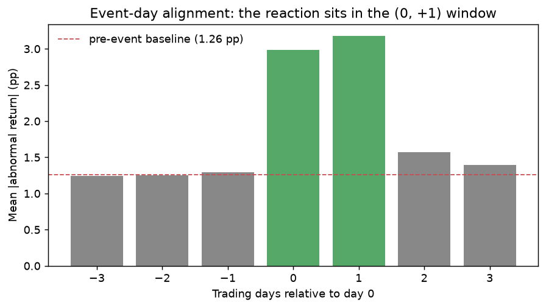
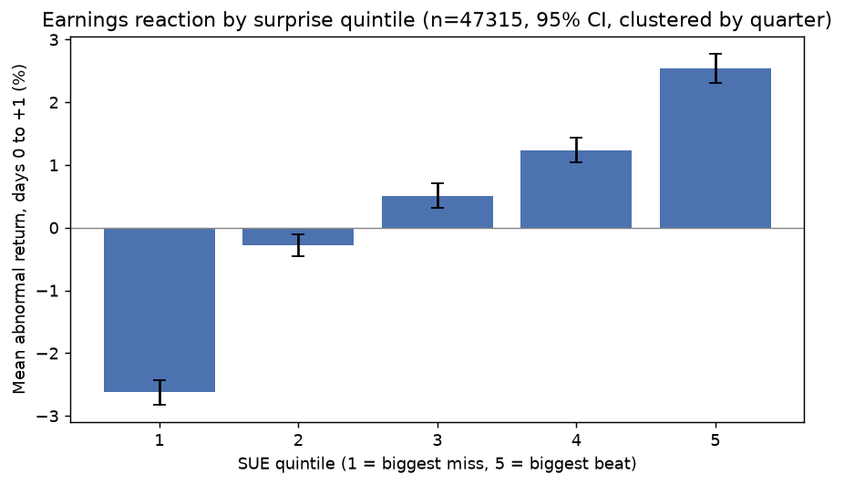
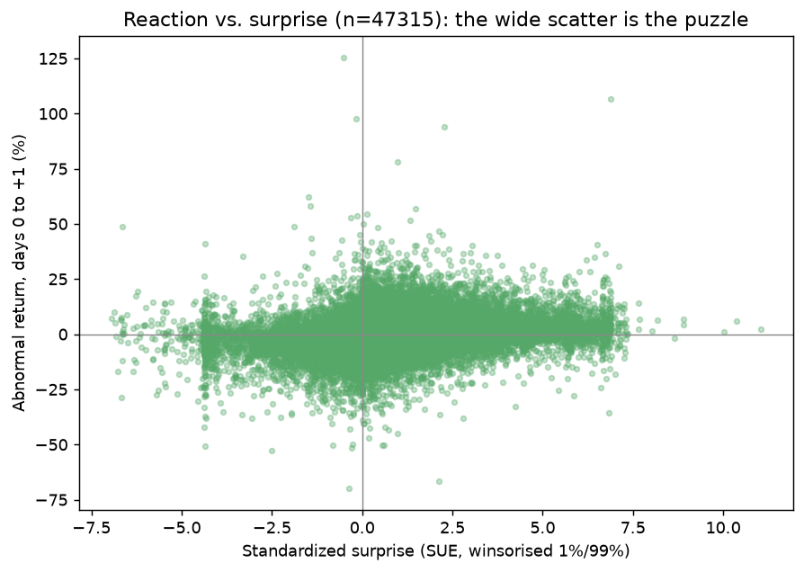
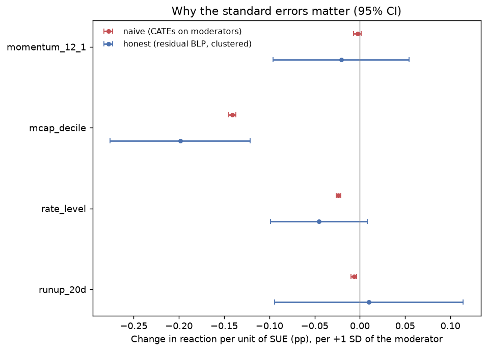
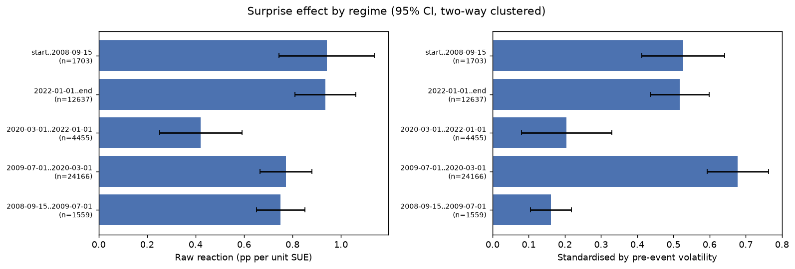
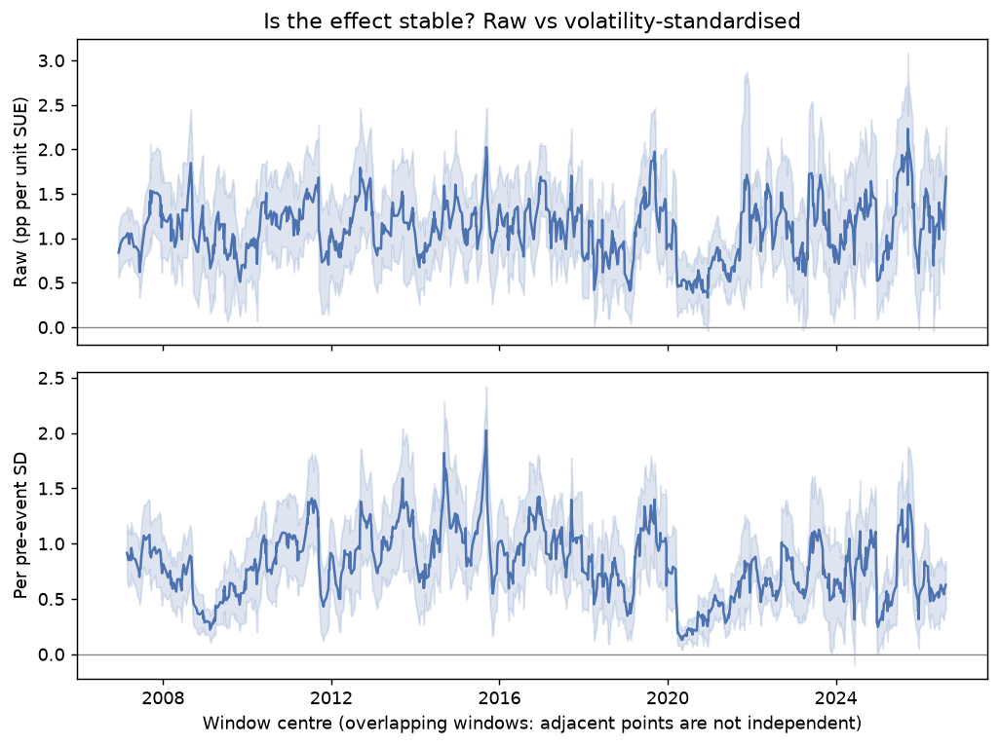
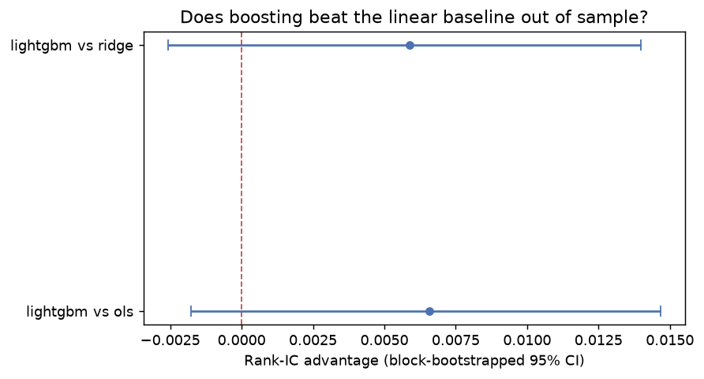
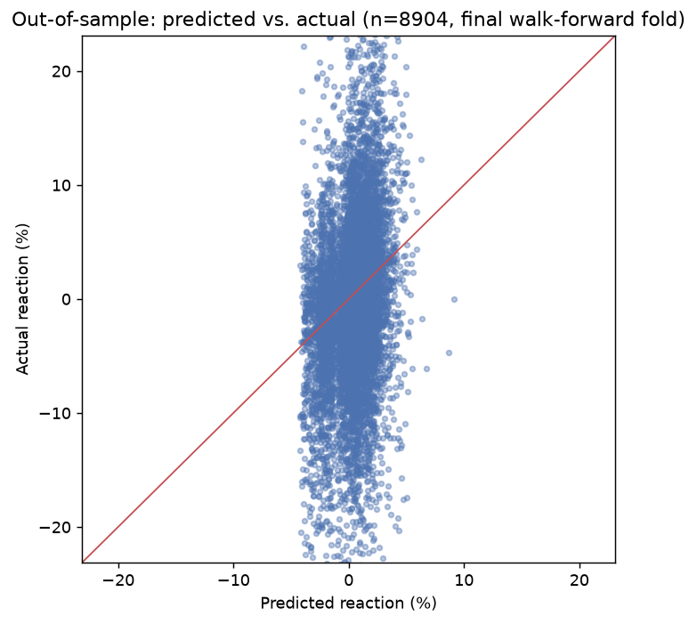
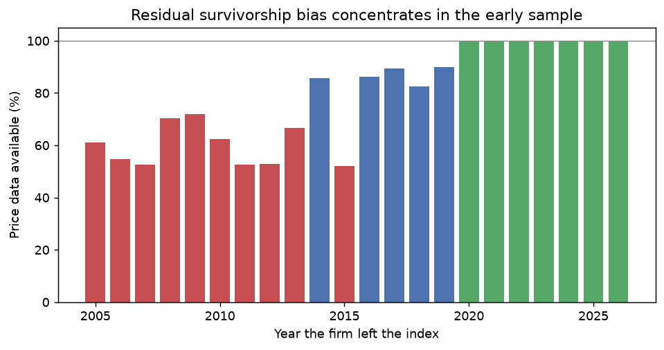
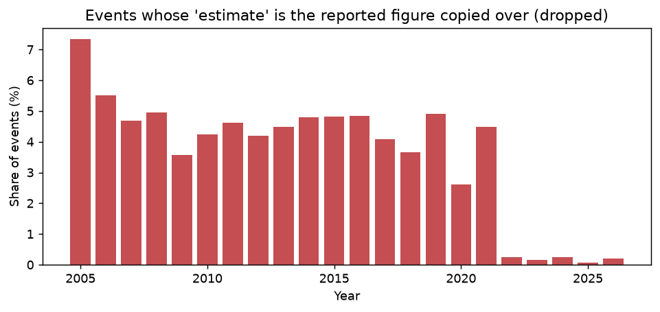

# Earnings Reaction Lab

**Why do identical earnings beats produce opposite price reactions?** When Meta beats EPS
estimates by ~5% the stock can fall 7%, while Shopify beats by a similar margin the same
season and rises 5%. The size of the surprise clearly is not the whole story. This project
measures *which conditions* change how the market reacts to an earnings surprise, using
~20 years of S&P 500 earnings events, and treats the question as two distinct problems:

- **Inference** — *what causes* the difference in reactions (the honest-standard-errors track).
- **Prediction** — *can we forecast* the reaction out of sample (the honest-OOS track).

> **[docs/FIXES-2026-09.md](docs/FIXES-2026-09.md)** documents 30 defects found and fixed in
> this codebase, each with the reproduction that demonstrated it and the test that prevents
> its return. Several changed the results materially. If you only read one file here, read
> that one.

The repository is built so that each method appears only where its assumptions earn their
keep, and the inference/prediction distinction is kept explicit throughout. The methodology
is the deliverable as much as any single number.

> **Status:** analytical pipeline implemented and unit-tested (112 tests, with simulation
> ground-truths for every estimator) and run end-to-end on live data. The **Results**
> section reports the full run: 48,056 earnings events across 730 S&P 500 constituents,
> October 2006 to September 2026, on point-in-time index membership. Data limitations are
> quantified in *Data quality* rather than left as general caveats.

## The approach in one picture

| Question | Method | Notebook | Why this tool |
|---|---|---|---|
| Is the data right; what's the average reaction? | Event study + cluster-robust OLS | 01 | Establishes the stylized fact and catches upstream bugs before trusting any estimator. |
| Effect of surprise size with many controls? | Post-double-selection lasso (BCH) | 02 | Valid inference on the coefficient of interest under high-dimensional controls; plug-in penalty, two-way clustered SEs. |
| Which conditions *moderate* the reaction (pre-specified)? | Interacted double lasso + Benjamini-Hochberg | 02 | Interpretable, communicable moderators with multiplicity control. |
| Which moderators, *without* pre-specifying? | Causal forest (CausalForestDML) + calibration | 03 | Nonparametric heterogeneity discovery, validated by a sort/calibration test so we don't report noise. |
| Can we predict the reaction OOS? | LightGBM + SHAP, purged/embargoed CV | 04 | Trees regularize internally; honest out-of-time evaluation; rank IC is the finance-native metric. |
| Does deep learning or text help? | FT-Transformer benchmark + FinBERT embeddings | 05 | Fair tabular benchmark on the same CV; transcripts capture guidance/tone that tabular features cannot. |

## Why these methods, in plain terms

- **Double selection, not naive control selection.** With many correlated controls,
  putting all of them in OLS overfits, and selecting a subset then running inference on the
  result invalidates the standard errors (the post-selection inference problem). The
  double-selection LASSO of Belloni, Chernozhukov & Hansen (2014) selects controls from
  *both* the outcome and the treatment equations, which restores valid inference on the
  surprise coefficient. The penalty is the theory-driven **plug-in** value rather than a
  cross-validated lambda, which would over-select.
- **Two-way clustered standard errors (firm x quarter).** Earnings events are not
  independent: a firm's quarters are correlated, and all firms reporting the same week
  share macro shocks. SEs are clustered in both dimensions (Cameron-Gelbach-Miller),
  with the covariance projected to the nearest valid (PSD) matrix.
- **Causal forest *is* double ML.** It residualizes outcome and treatment with ML nuisance
  models before splitting, so cross-fitting must respect clustering — we use GroupKFold by
  ticker. We never trust the forest until it passes a **calibration sort test**: bucket events
  by predicted effect, re-estimate the realized effect per bucket, and check the two agree.
  With ~20k events a forest will manufacture noise heterogeneity otherwise.
- **Purged, embargoed walk-forward CV.** The drift label spans about a month, so naive
  k-fold puts training events whose label window overlaps the test period into the training
  set, which is lookahead leakage that inflates measured skill. Training events within a
  purge window before each test block are dropped, and an embargo period after the block is
  also excluded.
- **Standardized surprise (SUE), not raw %.** Raw surprise-percent explodes for near-zero
  EPS denominators; SUE scales by each firm's own past surprise volatility (using only
  prior quarters), which is both better-behaved and the literature standard.

## What is exploratory, causal, and predictive — and under what assumptions

Three distinct questions, three standards of evidence:

- **Descriptive (in-sample).** The reaction distribution, the surprise-quintile sort, and
  the beats-vs-misses drift path summarise the sample. They describe associations; they are
  not out-of-sample forecasts and carry no causal claim.
- **Causal / heterogeneity (in-sample, under assumptions).** The double-selection LASSO and
  the causal forest estimate how the announcement reaction responds to the earnings
  surprise, and how that response varies with firm and market conditions. These are
  full-sample estimates, not forecasts.
- **Predictive (out-of-sample).** Only the gradient-boosted model and the linear baselines
  are evaluated out of sample, under purged/embargoed walk-forward CV. This is the only part
  that speaks to forecastability.

### Identifying assumptions (the causal part)

The earnings surprise is not randomly assigned, so a causal reading rests on assumptions,
not on an experiment:

- **Conditional unconfoundedness (selection on observables).** Given the controls, the
  surprise is treated as as-good-as-randomly assigned with respect to the reaction. This is
  the load-bearing assumption and it is strong: plausible confounders (management guidance
  and tone, options positioning, analyst dispersion) are only partially captured. Where it
  is doubtful, the estimates should be read as conditional associations rather than clean
  causal effects.
- **Overlap and SUTVA.** Standard common-support and no-interference conditions.
- **Approximate sparsity (double LASSO).** Belloni, Chernozhukov & Hansen (2014) require
  that a small number of controls capture most of the confounding; the plug-in penalty plus
  double selection then deliver valid inference on the surprise coefficient.

### Statistical assumptions and the dependence problem

The inference theory for these estimators was developed for i.i.d. data, but earnings
events form a firm x time panel with serial dependence (a firm's own quarters) and
cross-sectional dependence (firms reporting the same week share macro shocks):

- **Causal forests assume i.i.d. sampling** (Wager & Athey 2018; Athey, Tibshirani & Wager
  2019). Valid use on a panel requires assuming weak temporal dependence — stationary,
  mixing conditions — so the forest's averaging stays consistent. Cross-fitting is done by
  ticker (GroupKFold) to respect within-firm grouping, and the heterogeneity summaries the
  project actually reports, the best linear projection (BLP) of the surprise effect on the
  moderators and the calibration sort test, use **cluster-robust (by firm) standard errors**,
  so within-firm dependence widens the confidence intervals rather than being ignored. The
  BLP is estimated as the residual-interaction regression Y_res = a T_res + sum_j b_j (T_res
  x Z_j) on the forest's cross-fitted nuisance residuals, so its standard errors reflect
  sampling noise in the data. Regressing the forest's fitted CATEs on the moderators instead
  (`forest_blp_naive.csv`, kept for comparison) treats those fitted values as if observed
  without error and understates uncertainty by roughly an order of magnitude; an earlier
  version of this project reported that quantity. The forest's own point-wise intervals
  from the underlying estimator still rest on the i.i.d./mixing theory.
- **Double/debiased ML** (Chernozhukov et al. 2018) gives valid inference under cross-fitting
  and the sparsity/rate conditions above; serial and cross-sectional dependence are handled
  with two-way (firm x quarter) clustered standard errors.

The honest position: the descriptive and predictive results stand on their own, and the
causal/heterogeneity results are valid under the assumptions above — most importantly
conditional unconfoundedness and weak dependence — which this project states explicitly
rather than treating as automatically satisfied.

## Repository layout

```
src/erl/
  config.py            typed settings (ERL_ env prefix), data dirs, benchmarks
  fmp.py               rate-limit-aware, cached, resumable FMP client
  universe.py          point-in-time S&P 500 membership (survivorship handled)
  harvest/             surprises, prices, fundamentals, transcripts
  events/              returns/CARs, feature engineering, panel + leakage guards
  export.py            consolidate every result into results.xlsx / results.md
  harvest/             prices (split-adjusted locally), surprises, fundamentals, splits
  inference/           event study, double lasso, causal forest, stability tests
  predict/             purged CV, LightGBM+SHAP, FT-Transformer
  text/                transcript embedding + leakage-safe PCA features
  pipeline.py          end-to-end orchestrator (harvest -> panel -> inference -> predict)
notebooks/             01..06, jupytext percent-format (open in Jupyter or VS Code)
tests/                 112 tests; estimators verified against simulated ground truth
```

## Data

Primary source: **Financial Modeling Prep (FMP)**, with `yfinance` as a free price
cross-check. The pipeline adapts the universe to your plan: it first attempts
**point-in-time** S&P 500 membership via FMP's historical-constituents endpoint (the
proper survivorship fix, including names that later left the index); if that endpoint
is not in your plan, it falls back to the **current** constituents, and failing that to
a curated diversified subset. The current-membership and subset paths carry
**survivorship bias** (they only include today's members), which is logged at run time
and should be stated in any write-up based on them. Point-in-time membership requires a
plan that includes historical constituents (e.g. Premium).

The project is designed around a **phased data budget**:

1. **FMP Starter/Premium** covers earnings surprises, historical constituents, deep prices,
   and analyst estimates — everything for notebooks 01-04.
2. **One month of FMP Ultimate** to bulk-harvest ~10 years of earnings-call transcripts for
   notebook 05; they cache locally as parquet, after which you can downgrade. The RTX 4090
   then embeds from the local cache indefinitely.

Russell 1000 is a deferred stretch goal: FMP does not provide Russell membership, so it
needs a separate point-in-time source before inclusion.

## Reproducing the results

```
python -m venv .venv && source .venv/bin/activate
pip install -r requirements.txt
cp .env.example .env          # then add your ERL_FMP_API_KEY
python -m erl.pipeline all --universe pilot     # 30-ticker pilot, fast
python -m erl.pipeline all --universe sp500     # full point-in-time universe
```

GPU track (run on a CUDA machine): `pip install -r requirements-gpu.txt`, then
`notebooks/05_dl_and_text`.


## Methodological choices that move the numbers

### Construction choices that move the numbers

Four choices are load-bearing and are stated here rather than left in the code:

- **Day 0.** Price data is close-to-close, so day 0 is the first daily return that can
  contain the announcement: the announcement date for before-open reports, the next
  trading day for after-close reports. When the data source does not supply the timing,
  day 0 is the announcement date and the two-day (0, +1) window covers either case. The
  panel stage logs the share of events with unknown timing and a diagnostic of mean |AR|
  by day relative to day 0 (`alignment_diagnostic.csv`); a peak anywhere other than 0 or
  +1 is flagged as a misalignment. An earlier version shifted unknown-timing events forward
  a day, which put the window one day late for before-open reports and cut the measured
  miss reaction to roughly a quarter of its size.
- **SUE winsorisation.** SUE divides the EPS surprise by the standard deviation of the
  firm's own past surprises (at least four prior quarters). That denominator can be tiny,
  producing SUE values beyond +-20. Quintile sorts are rank-based and unaffected; the OLS
  slope, the double lasso and the causal forest are not, so `sue` is winsorised at the
  1st/99th percentiles and the raw value is kept as `sue_raw`. The reaction itself is not
  winsorised; the reported means use cluster-robust standard errors instead.
- **Target scale for boosting.** The reaction is stored as a decimal (0.01 = 1%). LightGBM's
  leaf penalties act on gradient sums on that same scale, so a tuning range written for
  percentage-point targets collapses the model to a near-constant when applied to decimals.
  The boosting stage fits on percentage points and converts predictions back. The stage
  writes `gbm_feature_usage.csv` (splits and gain per feature) and warns if the final model
  splits on a single feature, because such a model is a step function, not evidence about
  ML versus linear.
- **BLP standard errors.** See *Statistical assumptions* below.
- **Point-in-time discipline.** Fundamentals are shifted forward by a 90-day
  publication lag before the as-of match, because the key-metrics `date` is the
  fiscal period end rather than the filing date; SUE winsorisation uses quantiles
  from prior events only; and out-of-sample R-squared is benchmarked against the
  training mean rather than the test fold's own mean. Both momentum horizons are
  market-adjusted so the short-horizon and long-horizon features are comparable
  (`momentum_12_1_raw` keeps the total-return version). Roughly 13-16% of the
  panel is lost to `dropna` over features that need long histories, which pushes
  the effective sample start about a year past the panel start; the prediction
  stage logs it.

### Is the effect stable over time?

The sample spans a zero-rate regime, the COVID volatility shock and the 2022
rate repricing, so a single pooled coefficient is only meaningful if the
relationship is stable. `inference/stability.py` reports the surprise effect by
regime with regime fixed effects and a Wald test that the regime interactions
are jointly zero (two-way clustered, so a Chow test without homoskedasticity or
independence assumptions), plus the slope on a rolling 400-event window.
Breaks default to the GFC, its aftermath, the COVID shock and the 2022
repricing; any break the sample cannot support (outside its range, or leaving
fewer than 150 events on one side) is dropped with a log line, so the same
defaults hold whether the panel starts in 2005 or 2015. Outputs:
`regime_stability.csv`, `regime_stability_test.csv`, `rolling_effect.csv`,
`09_effect_stability.png`.


---

## Results

*Every number below comes from `data/processed/results.xlsx`, produced by
`python -m erl.pipeline all --universe sp500`. The source file for each figure is
named in its caption, so any figure can be traced back to the stage that made
it. Reproduce with the instructions in [docs/SETUP.md](docs/SETUP.md).*

---

### Sample

48,056 earnings announcements across 730 S&P 500 constituents, October 2006 to
September 2026. Index membership is reconstructed point-in-time from the
constituent change log, so a firm enters the sample when it joined the index and
leaves when it left; the 730 tickers include 355 names that are no longer
constituents. The first 21 months of the 2005 harvest window are consumed by
feature warm-up, since standardised unexpected earnings requires four prior
quarters and the 12-1 momentum feature requires 252 trading days.

The dependent variable is the cumulative abnormal return over the announcement
day and the following trading day, market-adjusted against the S&P 500. The
treatment is standardised unexpected earnings (SUE): the EPS surprise divided by
the standard deviation of the firm's own prior surprises, winsorised at the 1st
and 99th percentiles using only prior observations.

---

### 1. The two-day window is empirically necessary, not conventional



*Mean absolute abnormal return by trading day relative to day 0. Source:
`alignment_diagnostic.csv`.*

Mean |AR| runs at 1.26 pp on the three days before the announcement, rises to
2.99 pp on day 0 and 3.18 pp on day +1, then falls back to 1.57 pp by day +2.
The peak sits at +1, at 2.52 times the pre-event baseline.

The split between day 0 and day +1 is informative rather than incidental. The
earnings feed carries no announcement-time field, so all 48,056 events have
unknown timing. Firms reporting before the open move on day 0; firms reporting
after the close move on day +1. A one-day window would miss roughly half the
sample either way, which is why the reaction is measured over (0, +1).

---

### 2. Earnings surprises move prices, and three estimators agree



*Mean two-day abnormal return by SUE quintile, 95% CI clustered by quarter.
Source: `car_by_quantile`.*

The quintile sort is monotone: the largest misses average −2.6% and the largest
beats +2.5%, with the middle quintile near zero.

Three estimators of the continuous effect, on the same sample:

| estimator | effect (pp per unit SUE) | SE | t |
|---|---|---|---|
| Post-double-selection lasso | 0.720 | 0.050 | 14.3 |
| Causal forest ATE | 0.804 | 0.233 | 3.5 |
| Best linear projection, mean | 0.808 | 0.039 | 20.8 |

*Sources: `double_lasso_baseline.csv`, `forest_ate.csv`, `forest_blp.csv`.*

A one-standard-deviation earnings surprise moves the two-day abnormal return by
roughly 0.7 to 0.8 percentage points. The agreement across a regularised linear
estimator and a non-parametric one is the substantive check; the causal forest's
own ATE interval is the widest of the three and is the conservative figure.



*Source: `event_panel.parquet`. The scatter is the motivation for the
heterogeneity analysis: the conditional mean is clearly increasing, and the
conditional variance is enormous.*

---

### 3. Most apparent heterogeneity does not survive valid standard errors



*The same four moderators with two sets of 95% intervals. Source:
`forest_blp.csv`, `forest_blp_naive.csv`.*

This figure is the methodological core of the project. Both sets of intervals
describe the same coefficients from the same causal forest. The red intervals
come from regressing the forest's fitted conditional treatment effects on the
moderators; the blue from the best linear projection estimated on the forest's
cross-fitted residuals with errors clustered by firm.

The naive procedure understates the standard error by up to **32.7 times**. It
does so because fitted CATEs are smooth functions of the same moderators being
projected onto, so the regression fits them almost perfectly and the resulting
standard error describes the smoothness of the forest rather than sampling
uncertainty in the data. Under the partially linear model
`Y = θ(X)·T + g(X,W) + ε`, Robinson residualisation gives
`Y_res = θ(X)·T_res + ε`, so the projection of `θ(X)` on standardised moderators
`Z` is the regression `Y_res = a·T_res + Σ b_j·(T_res × Z_j) + u`, whose
coefficients carry standard errors reflecting noise in the data.

The consequence for the results:

| moderator | coefficient | honest t | naive t |
|---|---|---|---|
| `mcap_decile` | −0.0020 | **−5.02** | −9.20 |
| `rate_level` | −0.0005 | −1.66 | significant |
| `momentum_12_1` | −0.0002 | −0.54 | not significant |
| `runup_20d` | +0.0001 | +0.18 | significant |

Of three moderators the naive procedure declares significant at 5%, one
survives. The surviving result is economically sensible and strongly estimated:
**larger firms react less per unit of surprise**. A one-decile increase in
within-quarter market capitalisation reduces the reaction to a given surprise by
about 0.20 pp per unit of SUE. The sign is consistent with an
information-environment explanation, in which greater analyst coverage and more
pre-announcement disclosure would leave less of a given earnings surprise to be
impounded at the announcement, though nothing here tests that mechanism
directly: coverage and disclosure are not measured in this panel, and the
estimate is equally consistent with other size-correlated differences.

Two cautions on that coefficient. `mcap_decile` is a within-quarter decile over
the sample's own constituents, so it measures size relative to the S&P 500 rather
than to the market. And the estimate is a best linear projection of a
conditional effect, which identifies a predictive relationship under the
assumption that SUE is as-good-as-random conditional on the controls, not a
structural parameter.

---

### 4. The effect is not one number: it collapses during macro crises



*Surprise effect by regime, raw (left) and standardised by pre-event
idiosyncratic volatility (right), 95% CI two-way clustered by firm and quarter.
Regime boundaries are fixed from the macroeconomic record, not selected on the
outcome. Source: `regime_stability.csv`, `regime_stability_voladj.csv`.*

A Chow-type Wald test rejects parameter stability: χ²(4) = 28.3, p = 1.1×10⁻⁵ on
raw reactions and χ²(4) = 151.4, p ≈ 1×10⁻³¹ on volatility-standardised ones.
With n = 48,056 a Wald test will reject almost any exact null, so the magnitudes
carry the claim rather than the p-values.

Standardised effect, in pre-event standard deviations per unit of SUE:

| regime | effect | SE | n |
|---|---|---|---|
| to 2008-09-15 | 0.527 | 0.058 | 1,703 |
| **2008-09-15 to 2009-07-01** (GFC) | **0.161** | 0.029 | 1,559 |
| 2009-07-01 to 2020-03-01 | **0.678** | 0.043 | 24,166 |
| **2020-03-01 to 2022-01-01** (COVID) | **0.205** | 0.064 | 4,455 |
| 2022-01-01 to present | 0.518 | 0.042 | 12,637 |

The pattern is not a single break but a consistent contrast: both crisis windows
are low (0.161 and 0.205) and all three calm periods are high (0.527, 0.678,
0.518), a spread of 4.2 times between the extremes. Two independent crisis
episodes producing the same direction is considerably stronger evidence than one
break would be. The reading is that when aggregate uncertainty dominates,
firm-specific earnings news is impounded into prices far less; investors are
repricing macro risk rather than differentiating between firms.



*Rolling 400-event windows, raw (top) and volatility-standardised (bottom).
Windows overlap, so adjacent points are not independent observations. Source:
`rolling_effect.csv`, `rolling_effect_voladj.csv`.*

Volatility standardisation is the necessary robustness check here, because SUE is
standardised by construction while the abnormal return is not: in a
high-volatility period the same informational surprise mechanically produces a
larger raw return, and the estimated coefficient rises with no change in price
formation. The denominator is the standard deviation of daily abnormal returns
over trading days −60 to −11, which ends well before the announcement so neither
the reaction nor the run-up into it can inflate it.

The instability survives standardisation, and in fact strengthens: the
largest-to-smallest regime ratio rises from 2.23 raw to 4.20 standardised. The
raw series was understating the instability, not creating it.

---

### 5. Gradient boosting beats a linear baseline detectably but marginally



*Rank-IC advantage of LightGBM over each baseline, with block-bootstrapped 95%
intervals resampling whole quarters. Source: `prediction_significance.csv`.*

Walk-forward cross-validation with a 35-day purge, tuned by Optuna on the
interior folds with the final fold held out. All three models are evaluated on
the same fold with R² benchmarked against the training mean, which is the only
benchmark available at prediction time.

| model | rank-IC | R² | MAE |
|---|---|---|---|
| OLS | 0.2346 | 0.0419 | 0.0578 |
| Ridge | 0.2353 | 0.0423 | 0.0578 |
| LightGBM | 0.2411 | 0.0527 | 0.0574 |

*Source: `prediction_comparison.csv`, n = 8,904 in the final fold.*

Paired tests are required because the models predict the same events from the
same features and their errors are highly correlated. A Diebold-Mariano test on
per-event squared-error differences, clustered by quarter, separates LightGBM
from both baselines at p < 0.001. The block-bootstrapped rank-IC gap does not:
0.007 with a 95% interval of [−0.002, 0.015] against OLS, and 0.006 with
[−0.003, 0.014] against Ridge.

The honest reading is that boosting achieves a statistically detectable
improvement in squared-error loss and an economically marginal one in ranking
ability, and that the two metrics disagree about whether the difference is
demonstrable at all. A roughly 3% relative improvement in rank-IC would not
survive transaction costs in any implementation.



*Source: `gbm_oos_predictions.csv`. Predictions span roughly ±5% against actuals
of ±20%: the model captures the conditional mean and almost none of the
conditional variance, which is what an R² of 0.05 looks like.*

---

### 6. Data quality, quantified

Every figure below is a limitation rather than a result, stated with a number
attached.



*Price data availability for firms that left the index, by year of removal.
Source: `universe_coverage_by_era.csv`.*

**Survivorship.** Point-in-time membership identifies 465 firms that left the
index during the sample; price history is available for 355 of them, 76.3%.
Coverage of current constituents is 100%. The gap is concentrated in the early
sample: 52% to 72% for removals before 2015, 83% to 90% for 2016 to 2019, and
100% from 2020. The panel is therefore **not** survivorship-free, and the
residual bias falls hardest on the GFC-era regime, which is one side of the
stability comparison in section 4. This is a material caveat on that section
specifically.



*Share of events per year whose analyst estimate equals the reported figure.
Source: `estimate_backfill_by_year.csv`.*

**Placeholder estimates.** Where no analyst consensus existed, the data provider
fills the estimate field with the reported figure, which makes the surprise
exactly zero for reasons unrelated to information. These are identified by an
exact match between estimated and actual revenue (a ten-digit figure matching to
the dollar) and dropped: 1,892 events, 3.5% of the sample, concentrated before
2022 and peaking at 7.3% in 2005.

**Split adjustment.** Neither price endpoint available is split-adjusted, and
the provider back-adjusts inconsistently across symbols. Splits are therefore
applied locally from the splits feed, with each event verified against the
observed price before adjustment: of 618 split events, 85 were visible in the
prices and corrected, 396 were already adjusted by the provider and left alone,
and 137 were ambiguous. 38 split-shaped returns remain. Inspection attributes
these to genuine crises (First Republic, CIT, Kodak), share-class distributions
the feed does not cover, and one recycled ticker symbol. They fall inside a
feature window for 10 of 48,056 events, 0.02% of the sample.

**Announcement timing.** No announcement-time field is available, so day 0 is
the announcement date for all events and the two-day window absorbs
before-open and after-close reporting. See section 1.

**Interest-rate control.** The 10-year Treasury yield series is not available on
the data plan used, so `rate_level` is proxied by IEF, a 7-10 year Treasury ETF.
This is a price rather than a yield, so its sign is inverted relative to a yield
series. The coefficient is not statistically distinguishable from zero in any
case.

**Beta.** Abnormal returns are market-adjusted, which assumes a beta of one for
every firm. A market model estimated over a pre-event window would be the
standard alternative, and its absence is the most substantial remaining
limitation of the identification.

---

### What the diagnostics are for

`docs/FIXES-2026-09.md` documents 30 defects found and fixed in this codebase,
each with the reproduction that demonstrated it and the test that prevents its
return. Several changed the results materially: an event-day misalignment that
placed most of the measured reaction on the day before the announcement, a
best-linear-projection procedure whose standard errors were understated by a
factor of 33, a boosted model that had collapsed to a step function of one
feature, and a price series that was never split-adjusted.

The pipeline reports its own residual contamination rather than assuming
correctness: the alignment diagnostic, the survivorship coverage table, the
placeholder-estimate rate, the split-adjustment residual and the artifact
exposure measure are all produced on every run and surfaced in the summary
sheet. Several of the findings above were discovered because a correction was
made to report its own effectiveness instead of being trusted.


## Honest expectations

This is a study of a noisy phenomenon. The realised out-of-sample R-squared on individual
reactions is about 0.05, with a rank IC around 0.24 on the full sample — and the low
R-squared is a finding, not a failure. Much of the Meta-vs-Shopify divergence is
idiosyncratic (specific guidance wording, one weak segment) and cannot be captured by
transcript-embedding track exists. The contribution is a rigorous map of *which observable
conditions* systematically move the reaction, with inference that survives clustering and
multiple-testing scrutiny.

## License

MIT — see `LICENSE`.
